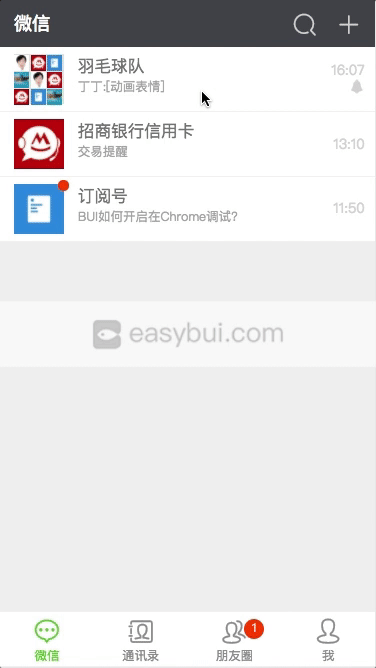

# BUI 教程

| **描述**             | **修订日期**    | **修订人**    |
|:--------------------|---------------:|---------------:|
| BUI 入门到进阶知识梳理  |2018-05-18      | 王伟深      |

## 简介

?> BUI 是用来快速构建界面交互的UI框架, 专注webapp开发, 开发者只需关注业务的开发, 界面的布局及交互交给BUI, 开发出来的应用, 可以嵌入平台 ( 微信, 钉钉, 淘宝, 支付宝等 ), 亦可以跟其它第三方平台打包成独立应用( Bingotouch , Cordova , Dcloud , APICloud , Appcan , 前海圆舟 等), 最终可以全跨平台展示.

欢迎加入我们的QQ技术交流群: `691560280`

## 案例效果

网易新闻: 耗时`半天`  |  QQ: 耗时`1天` |  微信: 耗时`2小时`

## 目录

* 入门

    * [为什么用BUI?](chapter1/why.md)
    * [介绍](chapter1/about.md)
    * [安装](chapter1/installation.md)
    * [快速开始](chapter1/quickstart.md)
    * [多页路由](chapter1/multipage.md)
    * [数据交互](chapter1/request.md)
    * [布局](chapter1/layout.md)
    * [调试](chapter1/debug.md)

* 进阶
    * [单页路由](chapter2/router.md)
    * [模块化](chapter2/loader.md)
    * [控件用法](chapter2/controls.md)
    * [动画交互](chapter2/animate.md)
    * [常用方法](chapter2/method.md)

* 效率
    * [BUI-Fast](tools/buifast.md)
    * [buijs-cli](tools/buijs.md)
    * [bui-template](tools/bui-template.md)

* 规范
    * [切图规范](ui/cutimage.md)
    * [开发规范](ui/standard.md)
    * [样式规范](ui/style.md)

* 帮助
    * [我要提问](https://github.com/imouou/BUI-Guide/issues/new)
    * [常见问题](help.md)

* [更新日志](changelog.md)

## 面向的开发者

?> 需要掌握一点前端基础知识, `html`,`css`,`javascript`或`jQuery` 

- 后端开发者
- 美工
- 前端开发者

## 在线阅读

[BUI教程](https://imouou.github.io/BUI-Guide/)

## 扫码体验

## 链接

[BUI官网](http://www.easybui.com)

