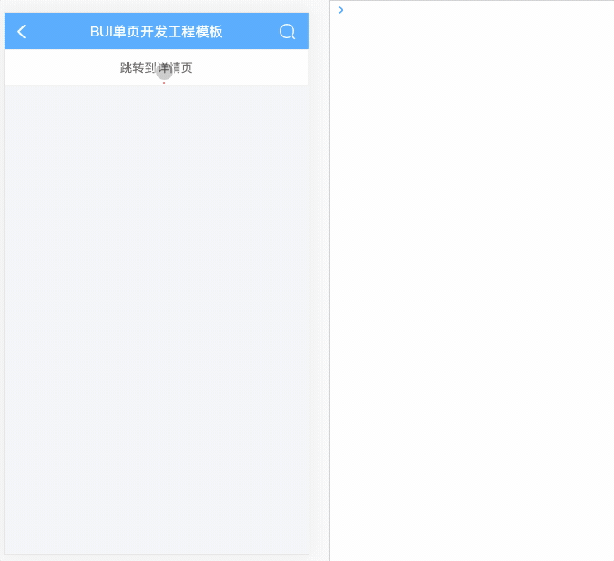

# 跳转与传参

> 通过修改首页的模板，实现点击跳转功能。

通过 `npm run dev` 默认打开的就是首页，`http://localhost:3000/#main` 

默认的首页模块名为`main` ，代表首页的主要入口，它是一个自定义名字的组件，可以指定任何一个页面组件作为首页。
默认的 *main* 指向的路径为 *pages/main/main.html* *pages/main/main.js* 。

## 静态跳转

*pages/main/main.html*

```html
<div class="bui-page bui-box-vertical">
    <header>
        <div class="bui-bar">
            <div class="bui-bar-left">
            </div>
            <div class="bui-bar-main">首页</div>
            <div class="bui-bar-right">
            </div>
        </div>
    </header>
    <main>
        <div class="bui-btn" href="pages/article/article.html?id=a1">跳转到详情页</div>
    </main>
</div>
```

main新增了一个按钮，按钮样式名为 `bui-btn` 加上`href=""`属性，指向一个相对路径，称为静态跳转，后面加了参数 `id=b1`。

## 动态跳转

在参数是未知的情况下，就需要用到动态跳转了。

*pages/main/main.html*

```html
<div class="bui-page bui-box-vertical">
    <header>
        <div class="bui-bar">
            <div class="bui-bar-left"></div>
            <div class="bui-bar-main">首页</div>
            <div class="bui-bar-right"></div>
        </div>
    </header>
    <main>
        <div id="gotoArticle" class="bui-btn">跳转到详情页</div>
    </main>
</div>
```

*pages/main/main.js*

```js
loader.define(function(require, exports, module, global) {
    
    // 单页模板里的DOM事件绑定需要把 $ 改成 router.$ 
    router.$("#gotoArticle").click(function(e){
        bui.load({
            url:"pages/article/article.html",
            param:{
                id: "b1"
            }
        })
    });
})
```

## 接收参数

有3种接收参数

*pages/article/article.js*

```js
loader.define(function(require, exports, module, global) {
    
    // 1. 接收组件参数包含URL, 推荐
    let params = bui.history.getParams(module.id);
    // params = { id: "a1"}

    // 2. 只接收URL参数
    let params = bui.history.getParams("url");
    // params = { id: "a1"}

    // 3. 1.7.x 支持
    let props = module.props

})
```

## 预览效果


