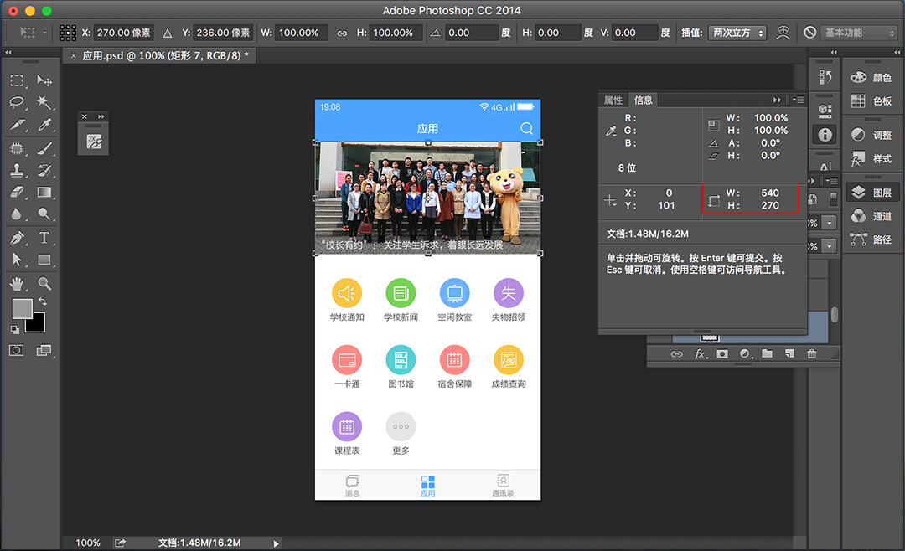

# 开发规范

遵循以下规范开发，可以避免开发中出现的奇奇怪怪的问题。

## 1. 切图规范

> BUI基于REM适配手机,保持跟原生DPI一致的缩放效果, 需要把设计稿转换为750的设计稿,量取到的值,直接除以100,便是rem值.

#### 量取设计稿内容的大小/100, 转成rem单位


```css
.slide { width:100%;height:2.7rem; } 
```


## 2. 目录规范


!> 注意: 工程目录下不能有`中文文件名`,会影响打包. 整个工程目录也不能有`中文路径`, 保存代码热更新才会有效. 

**目录说明:**

| **目录名**   | **描述**               | **是否必须**               |
|:------------- |:--------------------------------|--------------:|
| /app.json | 插件及跨域的配置        | 否 |
| /gulpfile.js | gulp编译配置        | 否 |
| /package.json | 工程依赖配置        | 否 |
| /src/index.html | 应用首页入口文件        | `是` |
| /src/index.js   | 路由的初始化脚本及全局事件     | `是` |
| /src/css/       | 应用样式及bui.css样式        | `是` |
| /src/font/      | bui.css用到的字体图标        | `是` |
| /src/images/       | 应用图片目录        | 否 |
| /src/js/       | 应用脚本        | `是` |
| /src/js/plugins       | 第三方插件目录,避免编译错误        | 否 |
| /src/js/platform       | 第三方平台脚本,避免编译错误        | 否 |
| /src/js/zepto.js   | bui.js默认依赖于zepto.js 或 jquery      | `是` |
| /src/js/bui.js     | BUI交互控件库        | `是` |
| /src/pages/       | 应用的模块，在这个文件夹下划分        | `是` |
| /src/pages/main/       | 默认路由初始化以后会先载入这个main模块        | `是` |
| /src/pages/main/main.html | main模块的模板        | `是` |
| /src/pages/main/main.js   | main模块的业务脚本     | `是` |

## 3. 路径使用规范

假设你的页面在 `pages/main/index.html`;

1. 单页开发, 使用相对根目录的路径, 无论你的页面的层级目录有多深, 里面的图片路径,跳转路径, 应该使用 `images/xxx.jpg`, `pages/xxx/xxx.html` 的写法;

2. 不使用绝对根路径的写法 `/images/xxx.jpg`, `/pages/xxx/xxx.html`; 打包后本地的路径查找会从 file:///xxxx 来查找你的文件, 最终导致路径错误.

## 4. 页面结构规范
?> 一个标准的结构包含, .bui-page 子集分别是 `header`, `main`, `footer` 等标签, `main` 标签必须有, 因为页面初始化的时候会自动撑开main的高度. 快速书写 `ui-page` <kbd>Tab</kbd>

```html
<div class="bui-page bui-box-vertical">
    <header class="bui-bar">
        <!-- 顶部固定内容 -->
        <div class="bui-bar-left">
            <!-- 左边有图标示例 -->
            <div class="bui-btn"><i class="icon-back"></i></div>
        </div>
        <div class="bui-bar-main">BUI开发工程模板</div>
        <div class="bui-bar-right">
            <!-- 右边有图标示例 -->
            <div class="bui-btn"><i class="icon-search"></i></div>
        </div>
    </header>
    <main>
        <!-- 中间内容 -->
    </main>
    <footer>
        <!-- 底部内容 -->
    </footer>
</div>
```

## 5. 模块化规范

1. 一个js 文件里面只能有一个 `loader.define` 的匿名模块;
2. 业务逻辑需要在 `loader.define` 里面,防止加载其它模块的时候冲突;
3. 模块的路径以及资源等,都使用相对路径;
4. 模块里面不能有`bui.ready`的执行;

```js
// 异步模块或组件
loader.define(function(requires,exports,module,global){
    // requires: 加载依赖模块
    // module: 当前模块的基本信息
    // global: 定义的全局方法 
    
    return {}
})
```

## 6. 事件绑定

?> 单页开发里面很容易造成事件重复绑定, 首先, `$` 选择器要改成 `router.$` 选择器.

```js

// 单页不应该这样绑定
$(".bui-page").click(function(e){

})

// 应该使用
router.$(".bui-page").click(function(e){
  console.log("点击了页面")
})

```
