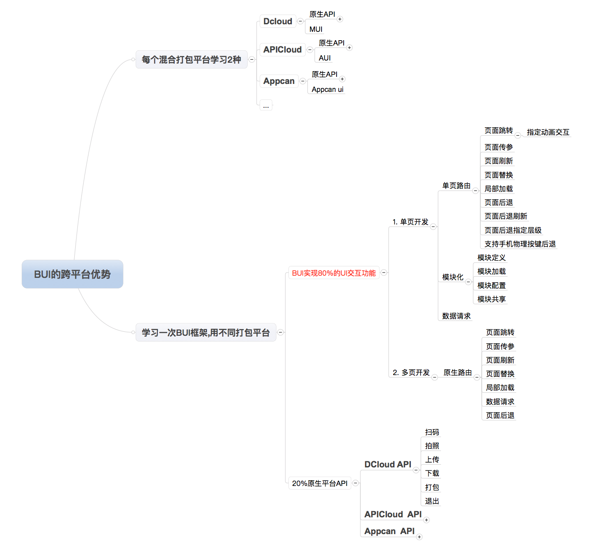

# 为什么用BUI?

?> 为什么要用,相信很多人有这样的疑问, 我以几个实际项目遇到的场景来说明下使用BUI的应用及好处吧. 


*场景1: webapp使用第三方平台打包?*

!> 开发好的webapp应用在浏览器跑的好好的,但在第三方平台打包以后,数据出不来! 

?> 这是因为有些平台本地打包的时候,禁止了跨域, 导致你原本的`$.ajax` 之类的web请求被禁止了, 因为这个请求,你要改的地方可能是N多个地方, 而使用BUI, 你用`bui.ajax`去请求你的数据,面对这种多变的情况, 你只需要改一个配置, 

`bui.isWebapp = false;` 

!>注意: `1.5.1 开始bui.ajax,bui.upload开始不再随状态改变, 需要再次通过全局配置,使用原生.  
```
bui.config.ajax={ needNative:true }` 
```

?> 这样页面的请求就会采用 原生平台的请求, 就没有跨域问题了. 这个也是BUI最早的设计初衷. 但BUI不仅限于这个跨域问题, 还有页面的切换等等, 你都可以一键切换为原生容器. 


?> 感兴趣的朋友还可以看看这篇文章,对BUI的设计以及使用方式都做了一定的说明,有助于理解.
<a href="https://segmentfault.com/a/1190000012994082" target="_target">2018开发最快的webapp框架--BUI设计思路解析</a>

*场景2: 开发好的打包应用,客户说要支持微信及浏览器?*

!> 我们用第三方的平台开发并打包了一个应用, 刚开始的需求是说, 只要安卓跟IOS版就好, 等做完以后, 客户觉得想要开发一个跨平台的版本,微信浏览器都能拥有基本功能!  

?> 这个时候,你的很多业务都是可以复用的, 但是由于用了平台结合的UI, 在跨平台上面表现不佳, 无法适配? 一切都得从头开始. 而使用BUI开发,一开始就是跨平台的, 所以并不存在效果不一致这个问题, 你需要的是, 把业务用到原生的部分去掉. 

*场景3: 第三方平台的迁移*

!> 假设你公司有一个自己的打包平台,有自己的UI, 有自己的原生API, 一切都近乎完美, 突然有一天, 客户说,我们想使用第三方平台开发打包, 一个客户说要用Dcloud,一个说要用APICloud,也可能是APPCan. 这时候, 一个混合框架包含原生API跟UI, 你的团队需要学习, `DCloud+UI`, `APICloud+UI`, `APPcan+UI` ... 每个UI都跟自己的框架结合紧密, 但最终团队的学习成本相当的高昂! 

?> 其实分析以后你会发现,一个应用的开发,很多效果,交互都应该是通用的, 只有少部分原生需要用第三方平台来开发, 这个时候你只需要使用 `BUI+APICloud`, `BUI+DCloud`, `BUI+APPCan` 等等, 你只需要用到原生api的时候,查一下, 开发方式还是按BUI的来, 最终可以在常用的平台都保持一致的交互效果, 学一个就够了. 



?>以上都是我们开发中遇到的真实客户需求, 用 BUI `以不变应万变`, 学习上手都很简单. 

- [了解更多特点](/chapter1/about) 
- [快速开始学习](/chapter1/quickstart) 
- [一个demo在不同平台的打包源码](https://github.com/imouou/BUI-Package) 