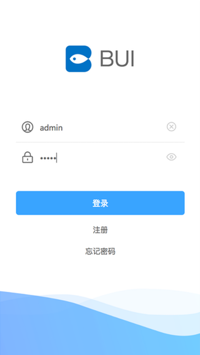

# 权限处理

?> 目前常用的登录权限有3种, 都放在了github上, [BUI登录权限处理](https://github.com/imouou/BUI-Login).

- 第1种: 你可以跳转到登录页, 登录操作以后, 执行后退刷新处理. (京东,淘宝都是这样的处理)


点击我的执行跳转处理
```js
bui.load({
  url:"pages/login/login.html"
})
```


?> 安装过`buijs`命令的用户, 可以使用以下命令, 创建这个案例下来参考, 查看到这种登录后退刷新的处理. 

```bash
buijs create case-tablogin
```


- 第2种: 也可以直接把登录页加载到当前页, 这样不用再纠结为什么登录后要用后退刷新? 只需要关闭掉登录页, 执行一次父级. 

点击我的把登录页加载进来.
```js
bui.page({
  url:"pages/login/login.html",
  close: true
})
```


- 第3种: 通过登录以后才能进入页面操作的

 


?> 安装过`buijs`命令的用户, 可以使用以下命令, 创建这个案例下来参考. 

```bash
buijs create case-indexlogin
```

