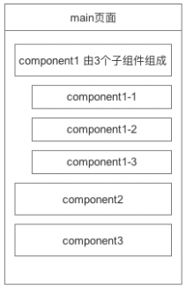
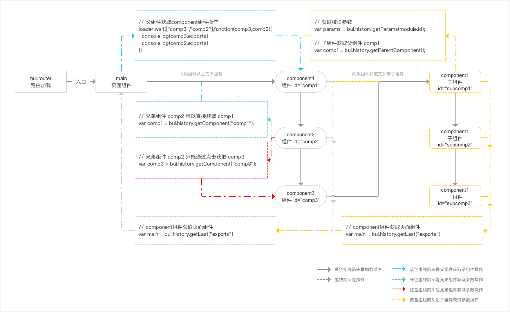

# 组件通讯

## 组件同步通讯
> 1.7.x 以上版本

异步通讯在业务比较复杂的情况下，会增加使用难度，1.7.x以后推荐使用同步加载组件的方式，需要工程化的支持。



假设 component1,component2,component3 在 *pages/components*目录下

*pages/main/main.html*
```html
...
<component id="comp1" name="pages/components/component1/index" delay="true"></component>
<component id="comp2" name="pages/components/component2/index" delay="true"></component>
<component id="comp3" name="pages/components/component3/index" delay="true"></component>
...
```

*pages/main/main.js*
```js
loader.define(async function(requires,exports,module,global){
    
    // 组件1
    var component1 = await loader.delay({
        id:"#comp1",
        param: {}
    });
    
    // 组件2
    var component2 = await loader.delay({
        id:"#comp2",
        param: {}
    });
    // 组件3
    var component3 = await loader.delay({
        id:"#comp3",
        param: {}
    });

    // 组件1可以拿到子组件的方法进行操作
    // component1.childs1
})
```

component1组件，里面有3个组件

*pages/components/component1/index.html*
```html
...
<component id="child1" name="pages/components/component1/child-1" delay="true"></component>
<component id="child2" name="pages/components/component1/child-2" delay="true"></component>
<component id="child3" name="pages/components/component1/child-3" delay="true"></component>
...
```
*pages/components/component1/index.js*
```js
loader.define(async function(requires,exports,module,global){
    
    // 组件1-1
    var childs1 = await loader.delay({
        id:"#child1",
        param: {}
    });
    // 组件1-2
    var childs2 = await loader.delay({
        id:"#child2",
        param: {}
    });
    // 组件1-3
    var childs3 = await loader.delay({
        id:"#child3",
        param: {}
    });

    // 子组件内部兄弟组件的交互

    return {
        childs1,
        childs2,
        childs3
    }
})
```

component1 的child1组件的定义

*pages/components/component1/child-1.html*
```html
<div class="bui-btn">按钮</div>

```
*pages/components/component1/child-1.js*
```js
loader.define(function(requires,exports,module,global){

  // 1.6.x 通过模块的id来获取不同的参数，所有属性的参数都会被拿到. 
  // var params = bui.history.getParams(module.id);
  // 1.7.x
  let params = module.props;

  // 通过 module.$ 绑定可以防止组件被重复加载导致重复绑定问题
  let $btn = module.$(".bui-btn");
    
  // 通过对象来描述组件的信息，便于维护
  const pageview = {
      init(){
        // 绑定事件
        this.bind(params);
        this.addColor(params);
      },
      addColor(opt){
        // 增加样式
        opt.color && $btn.addClass(opt.color);
      },
      bind(){
        let that = this;
        $btn.click(function(e){
          // 如果外部传方法，则点击的时候要执行该方法
          params.callback && params.callback.call(that,e)
        })

        return this;
      }
    }

    // 自执行
    pageview.init();

    // 可以抛出组件里面的方法给外部操作，也可以不抛出
    return pageview

})
```


## 组件异步通讯

> BUI 1.6.2以上版本. 



路由初始化以后就会去找 `main` 入口页, 假设`main`由3个组件组成, 会依次,从上到下加载组件, 加载以后再递归查找子组件, 如此反复.


### 父组件获取子组件

*pages/main/main.html*
```html
<component id="searchbar" name="pages/components/searchbar/index"></component>
<component id="list" name="pages/components/list/index"></component>
```

*pages/main/main.js*
```js
loader.define(function(){
    // 监听 多个子组件加载完成就会触发一次
    loader.waited(["searchbar","list"],function(searchbar,list){
      // 拿到子组件实例操作
      console.log(searchbar)
      console.log(list)
    })
})
```


### 子组件获取父组件

list组件 *pages/components/list/index.js*

```js
loader.define(function(require,export,module){
    // 1.6.1 的方式
    // var params = bui.history.getParams(module.id);
    // var parentComp = bui.history.getComponent(params.parentId);

    
    // 1.6.2 的方式
    var parentComp = bui.history.getParentComponent();
    // 拿到父组件return 出来的方法, 就可以操作父组件.

})
```

### 子组件获取页面组件

list组件 *pages/components/list/index.js*

```js
loader.define(function(require,export,module){
    // 无论被嵌套多少层都可以直接获取到页面组件
    var pageComp = bui.history.getLast("exports");

})
```

### 兄弟组件

?> 比方页面由 `搜索组件`, `列表组件` 组成, 点击搜索, 要操作列表的方法重新带上关键字请求;

页面组件 *pages/main/main.html*

```html
<div class="bui-page bui-box-vertical">
  <header></header>
  <main>
      <!-- 搜索组件 -->
      <component id="search" name="pages/components/searchbar/index"></component>
      <!-- 列表组件 -->
      <component id="list" name="pages/components/list/index"></component>
  </main>
</div>
```


search组件 *pages/components/search/index.js*

```js
loader.define(function(require,export,module){
    var pageview = {
      init: function(){
        // 这样是获取不到list组件的 refresh 方法, 因为list比search晚加载.
        // var list = bui.history.getComponent("list");

        module.$("#btnSearch").click(function(){

            // 在点击的时候可以获取到兄弟list组件.
            var list = bui.history.getComponent("list");

            // 获取搜索的关键字
            var keyword = module.$(".search-input").val();
            
            // 调用列表组件的局部属性方法, 把关键字传过去.
            list.refresh(keyword);
        })
      }
    }
    // 初始化
    pageview.init();
    return pageview
})

```

list组件 *pages/components/list/index.js*

```js
loader.define(function(require,export,module){
    var pageview = {
      init: function(){

      },
      refresh: function(keyword){
        // 接收到搜索传来的关键字进行请求操作
        console.log(keyword)
      }
    }
    // 初始化
    pageview.init();
    return pageview
})

```
!> 注意, 搜索组件在初始化直接获取list组件, 会获取不到, 因为list比search晚加载.

