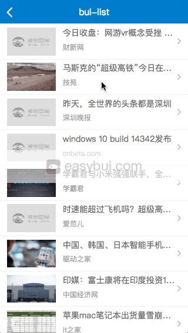

# 控件用法

## 前言

*前面[快速开始](chapter1/quickstart)已经讲解了控件的最基本用法, 学一个就会全部了. 控件之间还可以相互嵌套, BUI的控件主要可以分为3类: *

- **滑动交互控件:** *例如:*

    * 焦点图`bui.slide`, 选项卡`bui.slide`,列表下拉刷新及滚动加载`bui.list` , 下拉刷新`bui.pullrefresh`, 滚动加载`bui.scroll`, 抽屉控件`bui.swipe`, 侧边栏`bui.sidebar`, 侧滑菜单`bui.listview`, 日期选择 `bui.pickerdate`.

- **点击交互控件:** *例如:*
    * 上拉菜单`bui.actionsheet`,下拉菜单`bui.dropdown`,折叠菜单`bui.accordion`,选择菜单`bui.select`,星级评分`bui.rating`,步骤条`bui.stepbar`

- **弹出交互控件:** *例如:*
    * 遮罩`bui.mask`,正在加载`bui.loading`, 弹窗控件`bui.dialog`,提醒框`bui.alert`,确认框`bui.confirm`,输入框`bui.prompt`,自动消失提醒`bui.hint`

*注意:*

- BUI的控件主张以相同交互作为相同控件, 也就是一个控件不只做一件事, 比如, tab 是由 `bui.slide` 实现的, 结构一致,交互一致,配合样式来实现不同的效果. 
- 还有一个公共控件的概念需要注意, 同一个位置,只允许出现一个, 例如,遮罩`bui.mask`,正在加载`bui.loading`
- 参数 `height:0` 则是会自动计算高度,在布局比较复杂的情况下,需要自己计算后传进去.
- 每个控件都有一个全局配置,可以修改控件的默认配置`bui.config.控件名.参数`.

## 控件初始化
?> 以 `bui.list` 为例, 对控件的详细用法实例讲解. 这是每个应用都会用到的控件. 可以先了解下[bui.list API](http://www.easybui.com/demo/api/classes/bui.list.html) 

*例子: 列表下拉刷新,滚动加载 *


效果预览:



*生成结构, bui-fast 快速书写 `ui-list` <kbd>tab</kbd>*
```html
<div id="uiScroll" class="bui-scroll">
    <div class="bui-scroll-head"></div>
    <div class="bui-scroll-main">
        <!-- 这里是滚动的内容区,如果不是ul,则需要修改对应的参数 -->
        <ul class="bui-list">
        </ul>
    </div>
    <div class="bui-scroll-foot"></div>
</div>
```
*初始化, bui-fast 快速书写 `bui-list` <kbd>tab</kbd>*
```js
var uiList = bui.list({
        id: "#uiScroll",
        url: "userlist.json",
        data: {},
        template: templateList,
        height: 0,
        page:1,
        pageSize:10,
        field: {
            page: "page",        // 分页字段
            size: "pageSize",    // 页数字段
            data: "data"         // 数据
        },
        onLoad: function (scroll) {
            // 自定义渲染
        }
    });

    //生成列表的模板
    function templateList (data) {

        var html = "";

            $.each(data,function(index, el) {

                html += '<li class="bui-btn"><i class="icon-facefill"></i>'+el.name+'</li>';
            });

        return html;
    };
```
?> `bui.list`控件有个新手比较难理解的地方,就是`field`字段映射, 经常出不来数据. `templateList` 接收的数据来源于你配置的字段, 返回数组才能做对应的分页比对. 

*例如: 请求的接口是*
```html
http://www.easybui.com/api/getList?pagination=1&pagesize=9
```
*假设返回的数据是*
```js
{
    code: "200",
    results: [{
        id: "123"
        name: "新闻标题"
    }]
}
```
*bui.list的初始化, field的值应该是, 默认字段, `page:"page"`,`size:"pageSize"`,`data:""`*
```js
var uiList = bui.list({
    id: "#uiScroll",
    url: "http://www.easybui.com/api/getList",
    data: {},
    field: {
        page: "pagination",  // 页码字段
        size: "pagesize", // 页数字段, 相同字段可以不传
        data: "results"   // 返回的数据, 空则是整个数据
    },
    page:1,
    pageSize:10
})

```
!> 如果数据存在多层`results.data`, 则字段也需要像对象访问一样.

## 使用方法

*uiList的实例来源于前面的例子初始化*
```js
uiList.refresh();
```

## 事件监听

*事件全部为小写*
```js
// 刷新的时候触发
uiList.on("refresh",function(result){
    
});
```

## 修改参数
### option 方法
?> 通过`option`方法可以在控件初始化以后,重新修改初始化参数, 跟 `init`方法的区别是, `option`方法不一定会重新初始化, 比方在修改数据参数的时候. 

*例子: 修改下次请求的参数*
```js
uiList.option("data",{
    "lastId":"123",
})
```

## 获取依赖
### widget 方法
?> 通过`widget`方法,可以获取控件的内部依赖, 比方 `bui.list = bui.scroll + bui.ajax`组合而成.

*例子: 获取内部scroll的实例*
```js
返回所有依赖实例
var listWidget = uiList.widget();

引用内部的scroll
var scroll = uiList.widget("scroll");

调用scrollTop方法返回顶部
scroll.scrollTop();
``` 

## 控件嵌套

### 例子1: Tab嵌套Tab 

?> 控件跟控件之间的相互嵌套, 甚至里面还可以继续嵌套列表刷新, 跟列表侧滑. 

#### 效果预览 
[新开窗口编辑](http://jsbin.com/teyudot/edit?js,html,output)

<iframe src="http://jsbin.com/teyudot/edit?js,output" width="100%" height="500px" frameborder="0"></iframe>


#### 代码分析

*例如: 底部tab第1屏嵌套tab*

*一个Tab的结构, bui-fast 快速书写 `ui-slide-tab` <kbd>tab</kbd> *
```html
<div id="uiSlideTabChild" class="bui-tab">
    <div class="bui-tab-head">
        <ul class="bui-nav">
            <li>
                第1屏-1-菜单
            </li>
            <li>
                第1屏-2-菜单
            </li>
        </ul>
    </div>
    <div class="bui-tab-main">
        <ul>
            <li>
                第1屏-1-内容
            </li>
            <li>
                第1屏-2-内容
            </li>
        </ul>
    </div>
</div>
```
*合并在一块以后,因为tab菜单在底部,所以把菜单部分结构抽离到`footer`,初始化menu参数用id*
```html
<main>
    <div id="uiSlideTab" class="bui-tab">
        <div class="bui-tab-main">
            <ul>
                <li>
                    <!-- 第1屏 -->
                    <div id="uiSlideTabChild" class="bui-tab">
                        <div class="bui-tab-head">
                            <ul class="bui-nav">
                                <li>
                                    第1屏-1-菜单
                                </li>
                                <li>
                                    第1屏-2-菜单
                                </li>
                            </ul>
                        </div>
                        <div class="bui-tab-main">
                            <ul>
                                <li>
                                    第1屏-1-内容
                                </li>
                                <li>
                                    第1屏-2-内容
                                </li>
                            </ul>
                        </div>
                    </div>
                </li>
                <li>
                    第2屏
                </li>
            </ul>
        </div>
    </div>
</main>
<footer>
    <ul id="uiSlideTabNav" class="bui-nav">
        <li class="bui-btn active">Tab1</li>
        <li class="bui-btn">Tab2</li>
    </ul>
</footer>
```

*初始化 bui-fast 快速书写 `bui-slide-tab` <kbd>tab</kbd>*
```js

// 底部菜单TAB
var uiSlideTab = bui.slide({
    id:"#uiSlideTab",
    menu:"#uiSlideTabNav",
    children:".bui-tab-main > ul",
    scroll: true
})

// 第1屏的TAB
var uiSlideTabChild = bui.slide({
    id:"#uiSlideTabChild",
    menu:".bui-nav",
    children:".bui-tab-main > ul",
    scroll: true
})

// 禁止滑动操作,最新,最热.
uiSlideTabChild.lock();

```
!> 你可以选择让滑动操作TAB在哪一层, 如果没有手动设置,默认只滑动最底层结构.


### 例子2: 列表控件嵌套列表侧滑

#### 效果预览 

[在线预览](http://www.easybui.com/demo/index.html#pages/ui_controls/bui.list_listview)

!> 列表侧滑控件需要右键打开,并开启chrome模拟,才能滑动.

<iframe src="http://jsbin.com/pomafav/edit?js,output" frameborder="0" width="100%" height="500px"></iframe>

*例子2: *


### 代码分析
?> 这里就是一个`ui-list`生成的列表结构, 注意, ul 标签上的class 是 `bui-listview`, 所以`bui.list`初始化需要传一个`children`参数
```html
<div id="scrollListview" class="bui-scroll">
  <div class="bui-scroll-head"></div>
  <div class="bui-scroll-main">
    <ul id ="scrollList2" class="bui-listview"></ul>
  </div>
  <div class="bui-scroll-foot"></div>
</div>
```
*初始化*
```js
// 列表控件
var uiList = bui.list({
    id: "#scrollListview",
    url: "http://www.easybui.com/demo/json/userlist.json",
    children:".bui-listview",
    handle:"li",
    page:1,
    pageSize:9,
    template: templateList,
    field: {
        data: "data"
    }
});

// 列表侧滑控件, 没有采用动态生成菜单
var uiListview = bui.listview({
    id: "#scrollList2",
    callback: function (e,menu) {
        //关闭菜单
        menu.close();
    }
});

// 关键代码: 模板
function templateList (data) {
    var html = "";
    $.each(data,function(index, el) {
        html +='<li status="1" style="height:46px;">';
        html +='    <div class="bui-btn bui-box">';
        html +='        <div class="span1">'+el.name+'</div>';
        html +='        <i class="icon-listright"></i>';
        html +='    </div>';
        // 侧滑菜单结构
        html +='    <div class="bui-listview-menu swipeleft">';
        html +='        <div class="bui-btn primary">修改</div>';
        html +='        <div class="bui-btn danger">删除</div>';
        html +='    </div>';
        html +='</li>';
    });

    return html;
}
```
?> 关键代码在于模板的生成, `li`标签上有 `status=1` 属性, 并且还有高度样式, 这是告诉`bui.listview`控件,菜单按钮我已经生成了,你不要再生成了, 减少重复渲染. 

## 高级定制

?> 一切都在你理解了控件的实现原理,API方法以后,对于定制才能得心应手, 像 

- `通知公告`,`选项卡`,`多图滑动`都是基于`bui.slide`定制, 
- `bui.list`,`bui.scroll`,基于`bui.pullrefresh`定制, 
- `bui.sidebar`,`bui.listview`基于`bui.swipe`定制, 
- `bui.actionsheet`,`bui.alert`,`bui.confirm`,`bui.prompt`基于`bui.dialog`定制 

*等等, 都是基于他们交互相同扩展出来的例子, 这里我再举两个例子.*


### 例子1: 做一个返回顶部的功能.

?> 你可能会首先想到用`position:fixed`来做一个悬浮的操作, 很抱歉,IOS下不支持`fixed`的表现. 这也是为什么bui采用计算的方式来实现`main`滚动的原因,
其次你要知道,你当前操作的是哪个滚动条. 

*bui的标准结构,`footer`标签里面的内容,就会固定在底部. *
```html
<div class="bui-page">
    <header class="bui-bar">
        <div class="bui-bar-main">返回顶部</div>
    </header>
    <main></main>
    <i class="icon-listup"></i>
    <footer></footer>
</div>
```

*简单修饰下这个按钮,并给要操作返回顶部的地方,加上ID*
```html
<div class="bui-page">
    <header class="bui-bar">
        <div class="bui-bar-main">返回顶部</div>
    </header>
    <main id="scrollMain"></main>
    <div class="bui-btn round btn-scrolltop"><i class="icon-listup"></i></div>
    <footer></footer>
</div>
```

```css
.btn-scrolltop {
    position:absolute;
    bottom: .8rem;
    right:.15rem;
    z-index: 10;
}
```

```js
$(".btn-scrolltop").on("click",function(e){
    document.querySelector("#scrollMain").scrollTop = 0;
})
```

!> 注意: 这里如果是一个TAB,滚动的地方在 li标签 `.bui-tab-main > ul > li`

### 例子2: 省市区层级选择

?> 这是一个综合例子, 结合事件方法一起使用, 理解了这个例子, 才算真的理解BUI的控件的灵活之处.  

<iframe width="100%" height="450" src="https://jshare.com.cn/easybui/YJSLuW/4/share/result,js,html" allowfullscreen="allowfullscreen" frameborder="0"></iframe>

!> 上面的代码不能请求外部数据,想要预览效果,可以点击下面地址.

- [省市区层级选择](http://www.easybui.com/demo/#pages/ui_controls/bui.select_level_popup)


