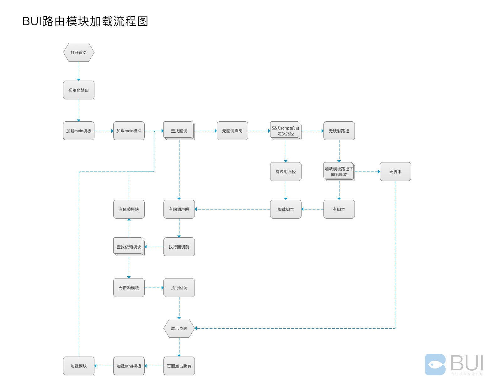
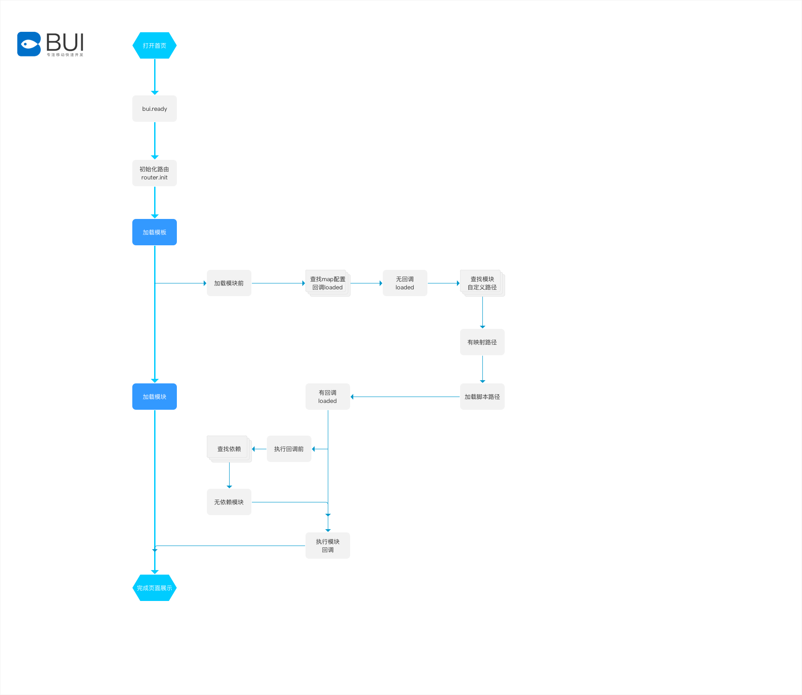
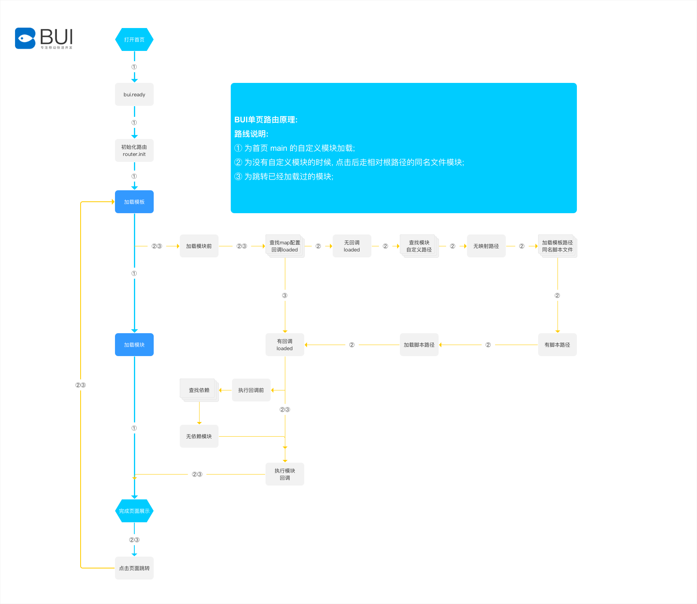
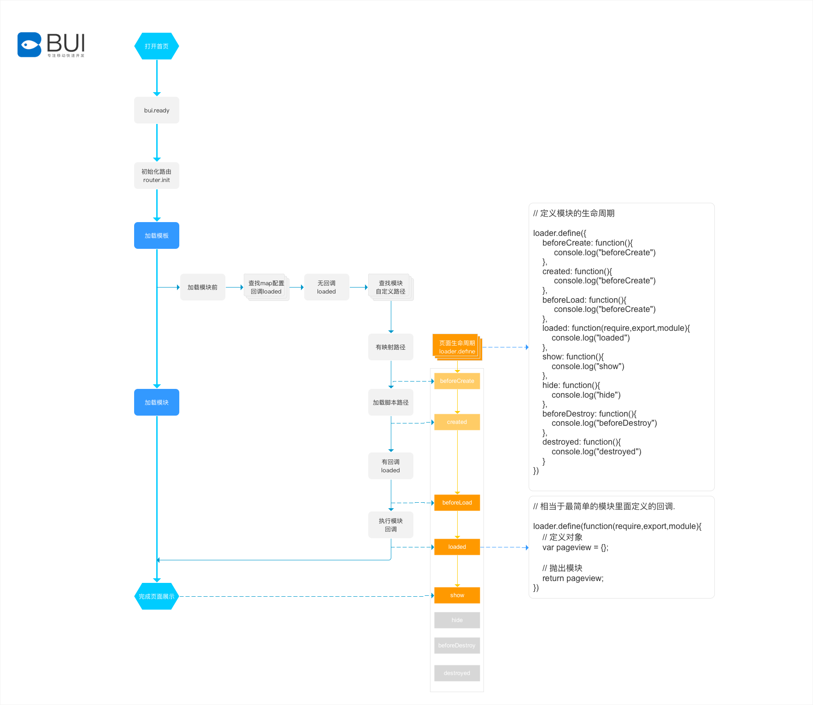
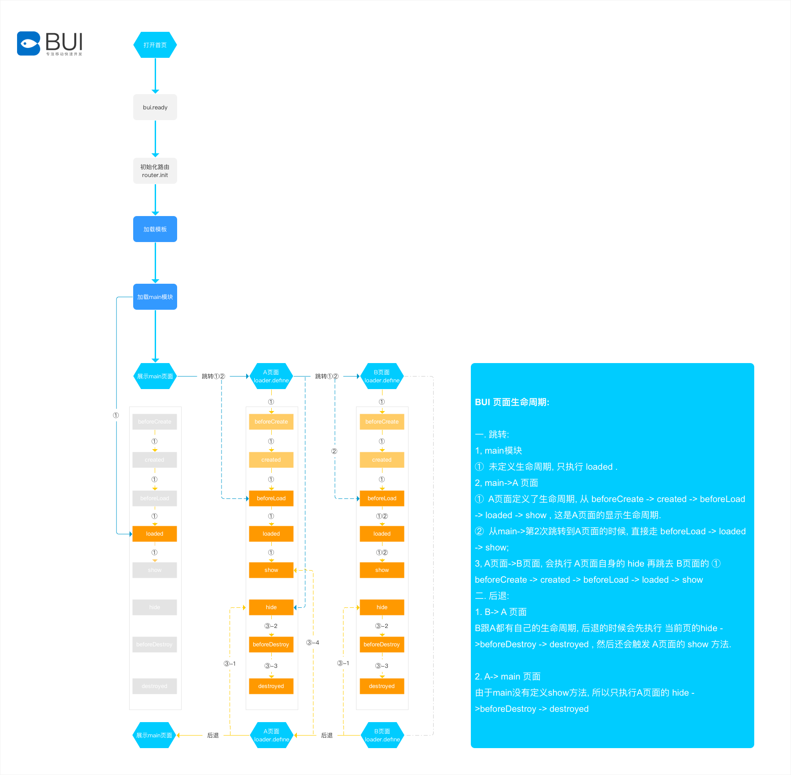

# 单页生命周期

### 路由原理

?> 这是路由加载的完整过程.

### 路由加载路线说明

- ① 为首页 main 的自定义模块加载, 已经配置了路径指向, 你可以通过 indexModule 参数修改main首页的指向;
- ② 为没有自定义模块的时候, 点击后走相对根路径的同名文件模块;
- ③ 为跳转已经加载过的模块;
- ④ 为只有模板,没有同名脚本路径走的路线;

#### 路线①: 自定义的main模块加载

#### 路线②: 点击跳转的页面加载, 默认跳转的路径就是模块名
#### 路线③: 已经加载过的页面,只需走loaded回调.

### 路由加载注意事项 
1. 打开路由及跳转页面都会先加载模板,再加载脚本;  
2. 单页只需要在首页执行一次 `bui.ready`;
3. 路由的初始化也必须在 `bui.ready` 里面执行;
4. 模块里面的选择器使用 `router.$` 替换 `$` ,确保你操作的是当前页面的模块的dom;
5. 如果需要修改 `bui.loader` 需要在 `window.router` 之前;
6. 路由的全局事件, 必须在 index.js 才能使用, 不能放在单独的模块里.

### 生命周期

?> 1.5.3 新增, 路由跳转页面会触发模块的加载, 从进入页面,跳转页面,后退页面完成一个页面的生命周期.

#### 页面展示的生命周期

?> 这是打开路由第一次加载 main模块以后触发的加载. 

#### 页面跳转后退之间的生命周期

##### 一. 跳转: 

1, main模块 

①  未定义生命周期, 只执行 loaded . 

2, main->A 页面

①  A页面定义了生命周期, 从 `beforeCreate -> created -> beforeLoad -> loaded -> show` , 这是A页面的显示生命周期. 
②  从main->第2次跳转到A页面的时候, 直接走 `beforeLoad -> loaded -> show`; 

3, A页面->B页面, 会执行 A页面自身的 hide 再跳去 B页面的 ① `beforeCreate -> created -> beforeLoad -> loaded -> show`

##### 二. 后退: 

1. `B->A` 页面
B跟A都有自己的生命周期, 后退的时候会先执行 当前页的`hide ->beforeDestroy -> destroyed` , 然后还会触发 A页面的 show 方法.

2. `A->main` 页面
由于main没有定义show方法, 所以只执行A页面的 `hide ->beforeDestroy -> destroyed`

### 使用
?> 具体查看模块的定义. [页面模块的生命周期](chapter2/loader?id=页面模块的生命周期)
