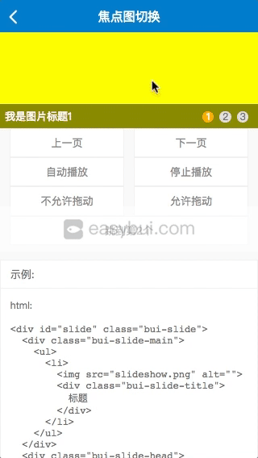
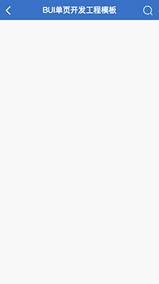

# 快速开始

?> 通过简单例子可以了解到bui的页面标准,及控件的基本使用, 后面还有一些工具的简单介绍. 

## 简单示例



?> 这是BUI最简单的使用方式,引入相应的库即可使用. 


```html
  <link rel="stylesheet" href="https://cdn.jsdelivr.net/npm/buijs/lib/latest/bui.css" />
  <!-- bui.js 依赖于Zepto或jQuery -->
  <script src="https://cdn.jsdelivr.net/npm/buijs/lib/zepto.js"></script>
	<script src="https://cdn.jsdelivr.net/npm/buijs/lib/latest/bui.js"></script>
```

*index.html*

```html
<!DOCTYPE HTML>
<html lang="en-US">
  <head>
  <meta http-equiv="Content-Type" content="text/html;charset=UTF-8" />
  <title>BUI 多页开发标准页面</title>
  <meta name="viewport" content="width=device-width, initial-scale=1, maximum-scale=1, minimum-scale=1, user-scalable=no">
  <link rel="stylesheet" href="https://cdn.jsdelivr.net/npm/buijs/lib/latest/bui.css" />
  </head>
  <body>
    <script src="https://cdn.jsdelivr.net/npm/buijs/lib/zepto.js"></script>
		<script src="https://cdn.jsdelivr.net/npm/buijs/lib/latest/bui.js"></script>
    <script>
        bui.ready(function() {
          // 所有控件及方法需要在这里执行
        })
    </script>
  </body>
</html>
```

?> 你还需要一个BUI的标准结构, 放在body中间. 

!> 1.6.x以后推荐使用以下结构,适配性更强

```html
<div class="bui-page bui-box-vertical">
  <header>
    <!-- 固定顶部区 -->
    <div class="bui-bar">
      <div class="bui-bar-left">
        <a class="bui-btn"><i class="icon-back"></i></a>
      </div>
      <div class="bui-bar-main">BUI标准页面</div>
      <div class="bui-bar-right"></div>
    </div>
  </header>
  <main>
    <!-- 内容区滚动 -->
  </main>
  <footer>
    <!-- 固定底部区 -->
  </footer>
</div>
```

!> 一个页面对应一个 bui-page, `bui-box-vertical`代表纵向布局, main自适应. BUI 页面标准模板,包含 header(非必须) main(内容滚动区) footer(非必须), 不建议使用 `position:fixed` `position:absolute` 样式. 

## 效果预览
?> 效果有点像这样: 可以直接在chrome浏览器打开html文件.



## 控件基本使用

?> 接下来我们给页面加一个焦点图控件, 一个BUI的控件包含结构跟脚本初始化. 结构放main标签里面.

*焦点图结构*

```html
<div id="uiSlide" class="bui-slide"></div>
```

!> 脚本初始化必须在 `bui.ready` 里面执行, 多页开发`一个页面对应一个` bui.ready 其它自由编写, 便于自己维护就好.

*焦点图初始化*

```js
  // 焦点图控件初始化
  var uiSlide = bui.slide({
        id: "#uiSlide",
        height: 380,
        autopage: true,
        data: [{
          image: "images/banner01.png",
          url: "pages/ui_controls/bui.slide_title.html",
        },{
          image: "images/banner02.png",
          url: "pages/ui_controls/bui.slide_title.html",
        }]
    })
```
?> 给实例增加事件监听. tab可以通过滑动、点击等方式触发, 需要通过以下方式来监听.

```js
  // 监听跳转以后触发
  uiSlide.on("to",function(){
    // 获取跳转后的索引，从0开始
    var index = this.index();
    console.log(index)
  })

```
?> 执行实例对应的方法, 具体请查看对应的 [API](http://www.easybui.com/demo/api/index.html).  

```js
  // 跳转到第2个,索引值从0开始
  uiSlide.to(1);

```

!> `注意:` 事件监听必须在方法执行之前. slide默认支持滑动,点击等事件, 但必须在手机或者开启Chrome设备预览才能操作,

## 在线预览


?> 最终组合以后的代码, 你可以点击这里 <a href="http://www.easybui.com/preview/?url=/guide/examples/chapter1/slide.html" target="_blank">在线预览效果</a>

<iframe src="http://www.easybui.com/preview/?url=/guide/examples/chapter1/slide.html" width="100%" height="800px" frameborder="0"></iframe>

*index.html*

```html
<!DOCTYPE HTML>
<html lang="en-US">
  <head>
  <meta http-equiv="Content-Type" content="text/html;charset=UTF-8" />
  <title>BUI 多页开发标准页面</title>
  <meta name="viewport" content="width=device-width, initial-scale=1, maximum-scale=1, minimum-scale=1, user-scalable=no">
  <link rel="stylesheet" href="https://cdn.jsdelivr.net/npm/buijs/lib/latest/bui.css" />
  </head>
  <body>
    <!-- BUI 页面标准模板,包含 header(非必须) main(内容滚动区) footer(非必须) -->
    <div class="bui-page bui-box-vertical">
      <!-- 固定顶部区 -->
      <header>
        <div class="bui-bar">
          <div class="bui-bar-left">
            <a class="bui-btn"><i class="icon-back"></i></a>
          </div>
          <div class="bui-bar-main">BUI标准页面</div>
          <div class="bui-bar-right"></div>
        </div>
      </header>
      <main>
        <!-- 焦点图 -->
        <div id="uiSlide" class="bui-slide"></div>
      </main>
      <footer>
        <!-- 固定底部区 -->
      </footer>
    </div>
    <script src="https://cdn.jsdelivr.net/npm/buijs/lib/zepto.js"></script>
		<script src="https://cdn.jsdelivr.net/npm/buijs/lib/latest/bui.js"></script>
    <script>
        bui.ready(function() {
          // 焦点图控件初始化
            var uiSlide = bui.slide({
                id: "#slide",
                height: 380,
                autopage: true,
                data: [{
                  image: "images/banner01.png",
                  url: "pages/ui_controls/bui.slide_title.html",
                },{
                  image: "images/banner02.png",
                  url: "pages/ui_controls/bui.slide_title.html",
                }]
            })
            // 监听跳转以后触发
            uiSlide.on("to",function(index){
              console.log(index)
            })
            // 跳转到第2个,索引值从0开始
            // uiSlide.to(1);
        })
    </script>
  </body>
</html>
```


## BUI-Fast 让编写更简单

?> 这是BUI的多页开发方式, 是不是很简单? BUI不止简单,还快. 上面的代码如果使用 `BUI-Fast` 插件来使用的话, 只需这几行代码就可以了. [如何安装BUI-Fast插件](https://github.com/imouou/BUI-Fast-Snippets/)

*方案1:*
- ui-html <kbd>Tab</kbd>    生成bui页面引用


- ui-page <kbd>Tab</kbd>    生成bui标准页面结构


- bui-slide-demo <kbd>Tab</kbd>  生成焦点图控件初始化代码及结构


*方案2: *
- ui-html <kbd>Tab</kbd>    生成bui页面引用
- ui-page <kbd>Tab</kbd>    生成bui标准页面结构
- ui-slide <kbd>Tab</kbd>   生成焦点图控件静态结构
- bui-slide <kbd>Tab</kbd>  生成焦点图控件初始化代码


## 准备好了吗?

?> `bui-fast` 跟 `buijs` 这里给大家做个简单的介绍, 接下来你可以继续学习

- [多页路由](chapter1/multipage)
- [组件化](chapter2/component)

