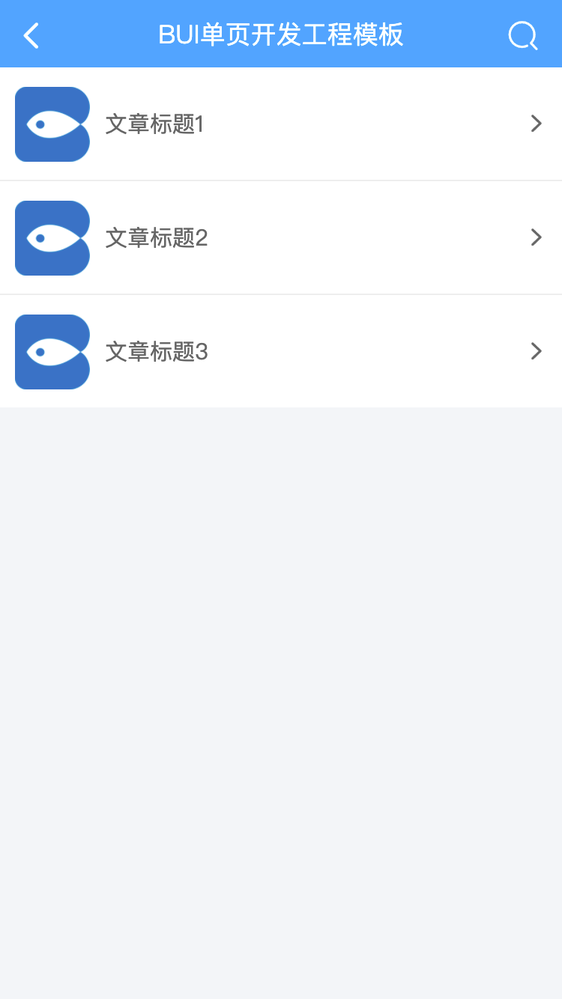

# 数据请求

?> 利用ajax+store的例子，实现一个普通列表的请求与展示。

## 模拟数据

1. 我们在main目录下，新建一个`main.json`的列表模拟数据，内容如下：

*pages/main/main.json*
```json
{
    "status":200,
    "data":[{
        "id":"bui1",
        "title":"文章标题1",
        "image":"images/applogo.png",
        "desc":"文章的内容简介"
    },{
        "id":"bui2",
        "title":"文章标题2",
        "image":"images/applogo.png",
        "desc":"文章的内容简介"
    },{
        "id":"bui3",
        "title":"文章标题3",
        "image":"images/applogo.png",
        "desc":"文章的内容简介"
    }]
}
```

2. 修改模板的绑定

*pages/main/main.html*

```html
<div class="bui-page bui-box-vertical">
    <header>
        ...
    </header>
    <main>
        <!-- 模板绑定，注释可以去掉，把结构注释可以便于打开html就可以知道模板生成什么内容 -->
        <ul class="bui-list" b-template="list.tplList(list.datas)">
            <!-- 
                <li class="bui-btn bui-box">
                    <div class="thumbnail"></div>
                    <div class="span1">文本</div>
                    <i class="icon-listright"></i>
                </li> 
            -->
        </ul>
    </main>
    <footer></footer>
</div>
```

3. 修改模块，一些简单的绑定使用store的模板即可处理

*pages/main/main.js*

```js
loader.define(function(require, exports, module, global) {

    // 初始化数据行为存储
    const bs = bui.store({
        el: `#${module.id}`,
        scope: "list",
        data: {
           datas: [],
        },
        mounted: function(){
            // 请求列表数据
            this.getList({
                url:`${module.path}main.json`,
                data: {}
            })
        },
        methods: {
            getList(opt){
                bui.ajax(opt).then((result)=>{
                    // 请求成功就赋值
                    this.datas = result.data;

                },function(result,status){
                    // 失败 console.log(status)
                });
            }
        },
        watch: {},
        computed: {},
        templates: {
            tplList:function(data){
                let html = "";
                data.forEach(item => {
                    html +=`<li class="bui-btn bui-box" href="pages/article/article.html?id=${item.id}">
                            <div class="thumbnail"></div>
                            <div class="span1">${item.title}</div>
                            <i class="icon-listright"></i>
                        </li>`
                });

                return html;
            }
        }
    })

    // 返回实例供外部调用
    return bs;
})
```

> 更多store的用法，请查看进阶篇[数据驱动](store/about)

## 效果预览


