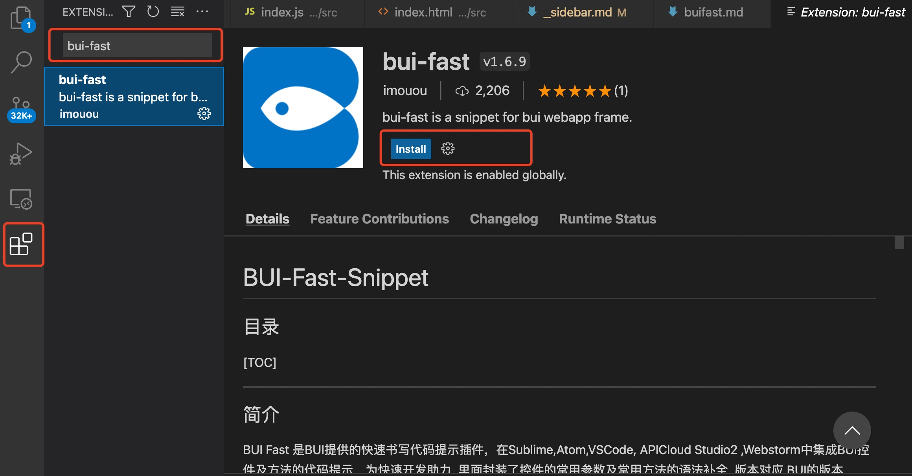

# 提高效率

`bui-fast`是一个BUI控件的代码片段，通过简单的控件名即可生成对应的结构及初始化。


## 安装bui-fast

这里以 *VSCode* 为例，通过应用市场搜索 `bui-fast`安装即可。其它编辑器可以查看[使用文档](https://github.com/imouou/BUI-Fast-Snippets)




## 基本使用

- html文件中，输入`ui-`，生成结构；
- js文件中，输入`bui-控件名-demo`的形式，输入一个完整的demo例子，再分别粘贴到html模板文件里。

*main.html*

例如：输入 `ui-list-thumbnail` 生成列表带缩略图的结构

```html
<!--列表带缩略图的结构-->
<ul class="bui-list bui-list-thumbnail">
    <li class="bui-btn bui-box">
        <div class="bui-thumbnail"></div>
        <div class="span1">
            <h3 class="item-title">商品标题</h3>
            <p class="item-text">天河区</p>
            <p class="item-text">3公里</p>
        </div>
        <span class="price"><i>￥</i>50</span>
    </li>
</ul>
```

例如：输入 `ui-box` 生成弹性布局结构

```html
<!--弹性布局结构-->
<div class="bui-box">
    <div class="span1"><!--自适应内容--></div>
</div>
```

*main.js*

例如：输入 `bui-slide-demo` 生成轮播图的初始化代码

```js

// 焦点图 js 初始化:
var uiSlide = bui.slide({
    id:"#uiSlide",
    height:380,
    autopage: true,
    loop: true,
    data: [{
        image: "images/banner01.png",
        url: "pages/ui_controls/bui.slide_title.html",
    },{
        image: "images/banner02.png",
        url: "pages/ui_controls/bui.slide_title.html",
    }]
})
                
// 焦点图 html 对应的结构:
<div id="uiSlide" class="bui-slide bui-slide-skin01"></div>
```


更多操作请查看[bui-fast使用文档](https://github.com/imouou/BUI-Fast-Snippets)