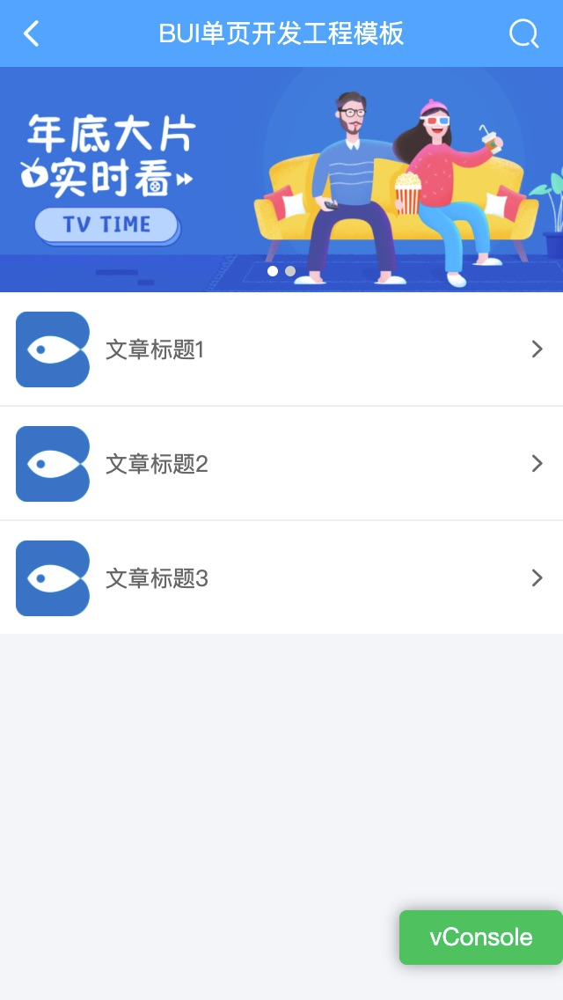

# 组件

> 组件：BUI的组件是包含同名的HTML结构及JS代码，按照特定格式组织可以复用的代码，BUI的组件默认是按需加载，也支持一次性加载。

## 特点

| 特点                | BUI模块           | BUI组件     |  ES6模块     
|:--------------------:|:---------------:|:---------------:|:---------------:|
| 静态编译  |       支持      | 支持      |   支持  
| 动态编译  |       支持      | 支持      |   <span style="color:red">不支持</span>  
| 一次性加载  |       支持      | 支持      |   支持  
| 按需加载  |       支持      | 支持      |   <span style="color:red">不支持</span>    

BUI组件跟模块的进一步区别：组件包含 html、js文件，且是默认执行初始化的；模块只有js文件，只定义，不执行。


## 组件定义

以轮播图为例，把以下两个文件，放到 `pages/` 目录下的任何位置，建议在 `pages/components/` 目录下，再新建一个`slide`的目录

*pages/components/slide/slide.html*

```html
<div class="bui-slide"></div>
```

*pages/components/slide/slide.js*

```js
loader.define(function(require, exports, module, global){
    // 1.7.x 支持，接收外部参数
    let props = module.props;
    // 1.6.x 支持，接收外部参数
    // let props = bui.history.getParams(module.id);

    // 通过component 的id进行初始化
    props.id = `#${module.id} .bui-slide`;
    // 处理默认参数
    props.height = props.height || 200;
    props.autopage = true;
    props.data = props.data || [{
        image: "http://easybui.com/demo/images/banner01.png"},
        {image: "http://easybui.com/demo/images/banner02.png"}
    ];

    // 初始化:
    const uiSlide = bui.slide(props);

    // 抛出组件供外部调用
    return uiSlide;
})
```

## 组件使用

只需一行代码（用id进行区分不同的组件）会把高度跟id传到组件中

```html
<!-- 第1个轮播图 -->
<component id="slide" name="pages/components/slide/slide" height="300"></component>

<!-- 第2个轮播图 -->
<component id="slideAd" name="pages/components/slide/slide" height="200"></component>
```

## 组件动态传参

动态传参需要等待数据加载完成，再编译组件，component标签加上`delay="true"`属性，直到`loader.delay`才会编译，且只编译一次。

*pages/main/main.html*

```html
<component id="slide" name="pages/components/slide/slide" delay="true"></component>
```

*pages/main/main.js*

```js
loader.define(function(require, exports, module, global){

    // 异步请求
    bui.ajax({
        url: "http://www.easybui.com/demo/json/slide.json",
    }).then(function(result){
        // 只编译一次组件
        loader.delay({
            id:"#slide",
            param: {
                height: 300,
                data: result.data
            }
        })
    });

})
```

## 组件同步开发

业务中有些接口会比较复杂，需要通过多次调用以后才能拿到最终的值，很容易导致回调地狱，利用es6的`async await`同步开发的方式则可以避免。

```js
loader.define(async function(require, exports, module, global){

    // 同步编译按顺序执行

    // 1. 同步请求token
    let token = await bui.ajax({
        url: "http://www.easybui.com/demo/json/token.json",
        data: {
            uid:"bui"
        }
    })
    // 2. 通过token请求接口
    let result = await bui.ajax({
        url: "http://www.easybui.com/demo/json/slide.json",
        data: {
            token:token.data
        }
    })
    // 3. 同步编译
    const uiSlide = await loader.delay({
        id:"#slide",
        param: {
            height: 300,
            data: result.data
        }
    })

})
```

!> 注意：同步开发需要编译工程的支持，直接部署或者本地打开的方式都会导致报错。

## 组件预览

修改浏览器的地址 `index.html#main` 为 `index.html#pages/components/slide/slide` 就可以直接预览效果



图片为整个页面的预览效果
