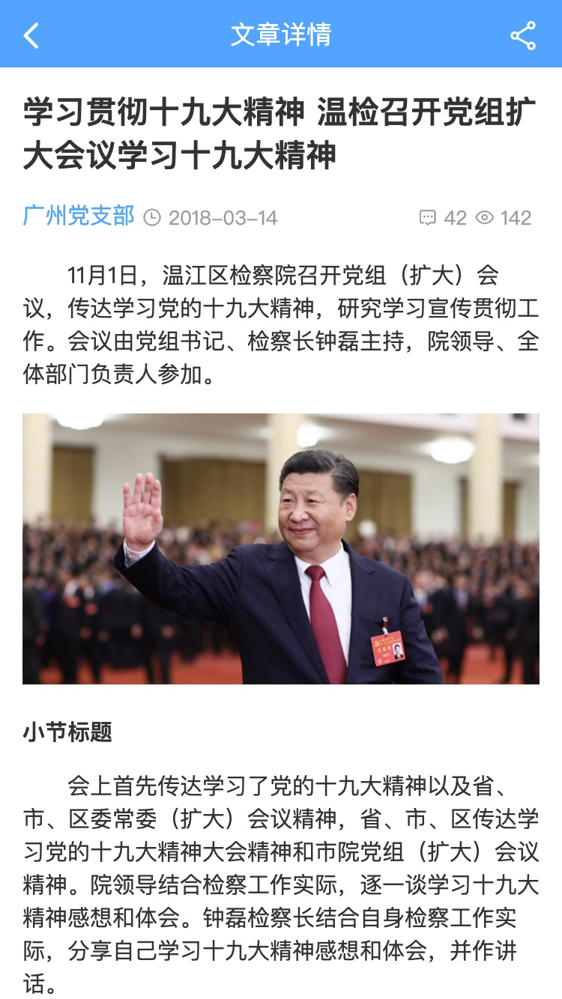

# 创建新页面

```bash
# 创建新页面
buijs create -t page-article
```

`-t` 为template的简写，`page-article` 为内置的模板名

更多模板及buijs命令的使用请参考[buijs使用文档](https://github.com/imouou/buijs-cli)

如果没有这个命令行，也可以根据页面的定义规则，手动创建。

## 新页面

BUI的单页页面，由同名不同类型的2个文件组成，一个是模板，一个是模块（包含特定的格式）。

通过上面命令会在工程 *src/pages/* 目录下新增一个 *article* 的文件夹，包含 *article.html* *article.js* 两个文件。

### 模板

*pages/article/article.html*

```html
<div class="bui-page bui-box-vertical">
    <header>
        <div class="bui-bar">
            <div class="bui-bar-left">
                <div class="bui-btn" onclick="bui.back();"><i class="icon-back"></i></div>
            </div>
            <div class="bui-bar-main">文章详情</div>
            <div class="bui-bar-right">
                <div class="bui-btn btn-share"><i class="icon-share"></i></div>
            </div>
        </div>
    </header>
    <main>
        <article class="bui-article">
            ...
        </article>
    </main>
</div>
```

### 模块

*pages/article/article.js*

```js
loader.define(function(require, exports, module, global) {
    // 业务逻辑必须在 loader.define 里面执行，默认进来就是执行的
    console.log("article page")
    // 接收上一个页面传过来的参数
    let params = bui.history.getParams(module.id)
})
```

通常用来接收上一个页面的参数，组织当前页面的业务及交互；


## 页面预览

修改浏览器的地址 `index.html#main` 为 `index.html#pages/article/article` 就可以直接预览效果


