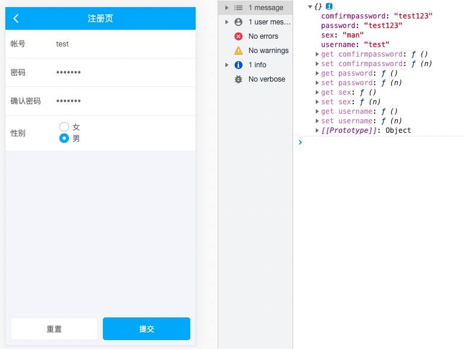

# 表单

## 基本元素

**综合效果展示**
<ul class="bui-list">
    <li class="bui-btn bui-box clearactive">
        <label class="bui-label">输入框</label>
        <div class="span1">
            <div class="bui-input user-input">
                <input type="text" value="" class="bui-input" placeholder="请输入手机号">
            </div>
        </div>
    </li>
    <li class="bui-btn bui-box clearactive">
        <label class="bui-label">密码框</label>
        <div class="span1">
            <div class="span1">
                <div id="passwordInput" class="bui-input">
                    <input id="password" type="password" placeholder="请输入密码">
                </div>
            </div>
        </div>
    </li>
    <li class="bui-btn bui-box clearactive">
        <label class="bui-label">多行输入框</label>
        <div class="span1">
            <div id="commentContent" class="bui-input">
                <textarea class="bui-input" cols="30" rows="4" placeholder="请输入内容"></textarea>
            </div>
        </div>
    </li>
    <li class="bui-btn bui-box clearactive">
        <label class="bui-label">滑动条</label>
        <div class="span1">
            <input type="range" class="bui-range" min="0" max="255" value="200">
        </div>
    </li>
    <li class="bui-btn bui-box clearactive">
        <label class="bui-label">切换按钮</label>
        <div class="span1">
            <input type="checkbox" class="bui-switch" value="1" checked="checked">
        </div>
    </li>
    <li class="bui-btn bui-box clearactive">
        <label class="bui-label">收藏</label>
        <div class="span1">
            <input type="checkbox" name="fav" class="bui-like warning" value="1">
        </div>
    </li>
    <li class="bui-btn bui-box clearactive">
        <label class="bui-label">点赞</label>
        <div class="span1">
            <input type="checkbox" name="like" class="bui-fav warning" value="1">
        </div>
    </li>
    <li class="bui-btn bui-box clearactive">
        <label class="bui-label">单选</label>
        <div class="span1">
            <label><input type="radio" class="bui-radio" name="sex" value="woman">女</label><label><input type="radio" class="bui-radio" name="sex" value="man">男</label>
        </div>
    </li>
    <li class="bui-btn bui-box clearactive">
        <label class="bui-label">多选</label>
        <div class="span1">
            <label><input type="checkbox" class="bui-checkbox" value="woman">女</label>
            <label><input type="checkbox" class="bui-checkbox" value="man">男</label>
        </div>
    </li>
    <li class="bui-btn bui-box clearactive">
        <label class="bui-label">自定义选择</label>
        <div class="span1">
            <div class="bui-fluid-space-3">
                <div class="span1">
                    <input type="radio" class="bui-check" name="chongzhi1" value="50" uncheck="50元" check="50元">
                </div>
                <div class="span1">
                    <input type="radio" class="bui-check" name="chongzhi1" value="100" uncheck="100元" check="100元">
                </div>
                <div class="span1">
                    <input type="radio" class="bui-check" name="chongzhi1" value="200" uncheck="200元" check="200元">
                </div>
            </div>
        </div>
    </li>
</ul>

<script>
// 显示删除按钮
var userInput = bui.input({
    id: ".user-input",
    callback: function(e) {
        // 清空数据
        this.empty();
    }
})
// 显示密码
var password = bui.input({
    id: "#passwordInput",
    iconClass: ".icon-eye",
    onBlur: function(e) {

        if (e.target.value == '') { return false; }
        // 注册的时候校验只能4-18位密码
        var rule = /^[a-zA-Z0-9_-]{4,18}$/;
        if (!rule.test(e.target.value)) {
            bui.hint("密码只能由4-18位字母或者数字上下横杠组成");
            return false;
        }

        return true;
    },
    callback: function(e) {
        //切换类型
        this.toggleType();
        //
        $(e.target).toggleClass("active")
    }
})

// 字数限制
var comment = bui.input({
    id: "#commentContent",
    showLength: true,
    showIcon: false,
    maxLength: 100
})
</script>

```html

<ul class="bui-list">
    <li class="bui-btn bui-box clearactive">
        <label class="bui-label">输入框</label>
        <div class="span1">
            <div class="bui-input user-input">
                <input type="text" value="" class="bui-input" placeholder="请输入手机号">
            </div>
        </div>
    </li>
    <li class="bui-btn bui-box clearactive">
        <label class="bui-label">密码框</label>
        <div class="span1">
            <div class="span1">
                <div id="passwordInput" class="bui-input">
                    <input id="password" type="password" placeholder="请输入密码">
                </div>
            </div>
        </div>
    </li>
    <li class="bui-btn bui-box clearactive">
        <label class="bui-label">多行输入框</label>
        <div class="span1">
            <div id="commentContent" class="bui-input">
                <textarea class="bui-input" cols="30" rows="4" placeholder="请输入内容"></textarea>
            </div>
        </div>
    </li>
    <li class="bui-btn bui-box clearactive">
        <label class="bui-label">滑动条</label>
        <div class="span1">
            <input type="range" class="bui-range" min="0" max="255" value="200">
        </div>
    </li>
    <li class="bui-btn bui-box clearactive">
        <label class="bui-label">切换按钮</label>
        <div class="span1">
            <input type="checkbox" class="bui-switch" value="1" checked="checked">
        </div>
    </li>
    <li class="bui-btn bui-box clearactive">
        <label class="bui-label">收藏</label>
        <div class="span1">
            <input type="checkbox" name="fav" class="bui-like warning" value="1">
        </div>
    </li>
    <li class="bui-btn bui-box clearactive">
        <label class="bui-label">点赞</label>
        <div class="span1">
            <input type="checkbox" name="like" class="bui-fav warning" value="1">
        </div>
    </li>
    <li class="bui-btn bui-box clearactive">
        <label class="bui-label">单选</label>
        <div class="span1">
            <label><input type="radio" class="bui-radio" name="sex" value="woman">女</label><label><input type="radio" class="bui-radio" name="sex" value="man">男</label>
        </div>
    </li>
    <li class="bui-btn bui-box clearactive">
        <label class="bui-label">多选</label>
        <div class="span1">
            <label><input type="checkbox" class="bui-checkbox" value="woman">女</label>
            <label><input type="checkbox" class="bui-checkbox" value="man">男</label>
        </div>
    </li>
    <li class="bui-btn bui-box clearactive">
        <label class="bui-label">自定义选择</label>
        <div class="span1">
            <div class="bui-fluid-space-3">
                <div class="span1">
                    <input type="radio" class="bui-check" name="chongzhi1" value="50" uncheck="50元" check="50元">
                </div>
                <div class="span1">
                    <input type="radio" class="bui-check" name="chongzhi1" value="100" uncheck="100元" check="100元">
                </div>
                <div class="span1">
                    <input type="radio" class="bui-check" name="chongzhi1" value="200" uncheck="200元" check="200元">
                </div>
            </div>
        </div>
    </li>
</ul>

```

## 表单控件

### 带删除图标

```html
<div class="bui-input user-input">
    <input type="text" value="" placeholder="请输入手机号">
</div>
```
```js
// 显示删除
var userInput = bui.input({
    id: ".user-input",
    callback: function(e) {
        // 清空数据
        this.empty();
    }
})
```

### 显示密码

```html
<div id="passwordInput" class="bui-input">
    <input type="password" placeholder="请输入密码">
</div>
```
```js
// 显示密码
var password = bui.input({
    id: "#passwordInput",
    iconClass: ".icon-eye",
    onBlur: function(e) {

        if (e.target.value == '') { return false; }
        // 注册的时候校验只能4-18位密码
        var rule = /^[a-zA-Z0-9_-]{4,18}$/;
        if (!rule.test(e.target.value)) {
            bui.hint("密码只能由4-18位字母或者数字上下横杠组成");
            return false;
        }

        return true;
    },
    callback: function(e) {
        //切换类型
        this.toggleType();
        //
        $(e.target).toggleClass("active")
    }
})
```

### 字数限制

```html
<div id="commentContent" class="bui-input">
    <textarea class="bui-input" cols="30" rows="4" placeholder="请输入内容"></textarea>
</div>
```

```js
// 字数限制
var comment = bui.input({
    id: "#commentContent",
    showLength: true,
    showIcon: false,
    maxLength: 100
})

```


## 表单案例

以 bui.store + 表单为例，开发一个注册页面。

> 快速书写：`ui-page` 生成BUI标准页面，`ui-form-edit` 编辑表单生成的左右结构，`ui-form-submit` 生成按钮提交结构，


以下结构加入了 `b-model`的实时绑定指令，绑定数据到store到datas的某个字段上，`b-model-lazy` 1.7.0 新增，支持输入结束后再绑定。

*pages/register/index.html*

```html
<div id="formpage" class="bui-page bui-box-vertical">
    <header>
       <div class="bui-bar">
        <div class="bui-bar-left">
            <a class="bui-btn" onclick="bui.back();"><i class="icon-back"></i></a>
        </div>
        <div class="bui-bar-main">注册页</div>
        <div class="bui-bar-right"></div>
       </div>
    </header>
    <main>
        <ul class="bui-list">
            <li class="bui-btn bui-box clearactive">
                <label class="bui-label">帐号</label>
                <div class="span1">
                    <input type="text" class="bui-input" value="" placeholder="请输入邮箱账号" b-model="form.datas.username">
                </div>
            </li>
            <li class="bui-btn bui-box clearactive">
                <label class="bui-label">密码</label>
                <div class="span1">
                    <input type="password" class="bui-input" value="" placeholder="请输入密码" b-model="form.datas.password">
                </div>
            </li>
            <li class="bui-btn bui-box clearactive">
                <label class="bui-label">确认密码</label>
                <div class="span1">
                    <input type="password" class="bui-input" value="" placeholder="请再次输入密码" b-model="form.datas.comfirmpassword">
                </div>
            </li>
            <li class="bui-btn bui-box clearactive">
                <label class="bui-label">性别</label>
                <div class="span1">
                    <label><input type="radio" class="bui-radio" value="woman" b-model="form.datas.sex">女</label>
                    <label><input type="radio" class="bui-radio" value="man" b-model="form.datas.sex">男</label>
                </div>
            </li>
        </ul>
    </main>
    <footer>
        <div class="container-y">
            <div class="bui-box-space">
                <div class="span1">
                    <div class="bui-btn round" b-click="form.reset">重置</div>
                </div>
                <div class="span1">
                    <div class="bui-btn round primary" b-click="form.submit">提交</div>
                </div>
            </div>
        </div>
    </footer>
</div>

```

*pages/register/index.js*

```js
loader.define(function(requires, exports, module, global){
    // 初始化数据行为存储
    const bs = bui.store({
        el: `#formpage`,    // 容器下的行为指令
        scope: "form",      // 容器下的相同作用域指令
        data: {
            datas: {
                username:"",    // 账号名
                password:"",    // 密码
                comfirmpassword:"",//确认密码
                sex:"woman",         //性别
            },
        },
        methods: {
            submit(){
                // 模拟发起请求，提交
                console.log(this.datas);
                bui.ajax({
                    url: global.apiurl + "json/token.json",
                    data: this.datas // 表单收集到的内容
                }).then((res)=>{
                    bui.hint("提交成功")
                })
            },
            reset(){
                // 重置清空
                this.datas = {
                    username:"",    // 账号名
                    password:"",    // 密码
                    comfirmpassword:"",//确认密码
                    sex:"",         //性别
                }
                bui.hint("重置成功");
            }
        },
        templates: {},
        mounted: function(){
            // 数据解析后执行
        }
    })

    return bs;
})
```

点击提交按钮，得到右边的数据

## 效果预览



## 表单校验


### 全局校验

在表单填写完成以后提交的时候再做提醒。

在methods新增一个方法，用于全局校验，点击提交才触发

*pages/register/index.js*

```js
...
methods: {
    checkForm(datas){
        // 全局校验
        for(let key in datas ){
            let item = datas[key];
            if( item === ""){
                bui.hint(`${key}的内容不能为空`)
                return false;
            }
        }
        if( datas["password"] !== datas["comfirmpassword"]){
            bui.hint(`两次密码不一致，请检查后提交`)
        }
        return true;
    },
    submit(){
        // 如果有为空的数据不能提交
        let canSumit = this.checkForm(this.datas);
        if( !canSumit ){
            return;
        }

        bui.ajax({
            url: global.apiurl + "json/token.json",
            data: this.datas // 表单收集到的内容
        }).then((res)=>{
            bui.hint("提交成功")
        })
    },
}
...
```

> 真正的表单校验肯定比示例要复杂很多，复杂的校验可以使用第三方插件校验。

### 局部校验

局部校验有两种方式，一种是失去焦点的时候执行方法判断（1.6.0以上），一种是实时判断触发（1.7.0以上支持）


*pages/register/index.html*

1.6.x 失去焦点判断 `b-blur`

```html
<div id="formpage" class="bui-page bui-box-vertical">
    ...
    <main>
        <ul class="bui-list">
            <li class="bui-btn bui-box clearactive">
                <label class="bui-label">帐号</label>
                <div class="span1">
                    <input b-model="form.datas.username" b-blur="form.checkRule($this,'username')" rule="/.+@qq.com/" tip="正确格式为：xxx@qq.com" type="text" class="bui-input" value="" placeholder="请输入qq邮箱账号" >
                </div>
            </li>
            ...
        </ul>
    </main>
    ...
</div>
```

1.7.x 实时判断 `b-trigger`

```html
<div id="formpage" class="bui-page bui-box-vertical">
    ...
    <main>
        <ul class="bui-list">
            <li class="bui-btn bui-box clearactive">
                <label class="bui-label">帐号</label>
                <div class="span1">
                    <input b-model="form.datas.username" b-trigger="form.checkRule($this,'username')" rule="/.+@qq.com/" tip="正确格式为：xxx@qq.com" type="text" class="bui-input" value="" placeholder="请输入邮箱账号">
                </div>
            </li>
            ...
        </ul>
    </main>
    ...
</div>
```

*pages/register/index.js*

```js
...
methods: {
    regexFromString(string) {
        // 把正则字符串转为表达式
        var match = /^\/(.*)\/([a-z]*)$/.exec(string) 
        
        return new RegExp(match[1], match[2])
    },
    checkRule(dom,keyname){
        // 自定义规则
        let rule = dom.getAttribute("rule");
        // 自定义提醒
        let tip = dom.getAttribute("tip");
        // 转正则表达式
        let regexp = this.regexFromString(rule);
        // 取值
        let val = dom.value;

        if( !regexp.test(val) ){
            // 清空错误格式 属性为 b-trigger 时不做清空处理
            this.datas[keyname] = "";
            // 提醒
            bui.hint(tip)
            return false;
        }
    },
}
...
```

