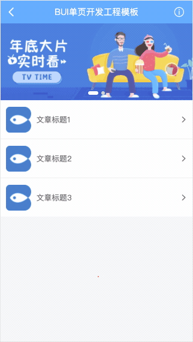

# 登录权限

登录的权限的处理取决于你的应用展示方式，展示方式不同，实现方式也会有所不同。

## 1. 首页登录

最简单的一种处理，只需配置首页`main`的指向为登录页，每次都只能通过首页登录进来。

*src/index.js*

```js

bui.ready(function(global) {
    
    // 初始化路由
    router.init({
        id: "#bui-router",
        indexModule:{
            template:"pages/login/index.html",
            script:"pages/login/index.js",
        },
        beforeLoad(e){
            let token = global.storage.get("token",0);
            // 如果不在登录页，且没有用户信息，则只能进入首页
            if( e.target.name !== "main" && !token){
                bui.load({
                    url:"main"
                })
                // 禁止进入其它页面
                return false;
            }
        }
    })
})
```

*pages/login/index.js*

```js
...
// 修改登录成功的方法
submit(){
    bui.ajax({
        url: global.apiurl + "json/token.json",
        data: this.datas // 表单收集到的内容
    }).then((res)=>{
        bui.hint("登录成功")
        // 保存token,用于跳转前的检测
        global.storage.set("token",res.data);

        // 跳转到列表页，这时候main指向的是 pages/login/index.html
        bui.load({
            url:"pages/main/main.html"
        })
    })
}
...
```

## 2. 全局登录

在任意的页面里面，根据需要展示登录。

1. 右上角新增触发登录按钮

*pages/main/main.html*

```html
<div class="bui-btn" b-click="list.login"><i class="icon-info"></i></div>
```

2. 定义个打开弹窗的方法，以及关闭弹窗以后的数据操作方法。

*pages/main/main.js*

```js
loader.define(function(requires, exports, module, global){

    // 登录页
    var loginPage = null;
    
    // 初始化数据行为存储
    const bs = bui.store({
        el: `#${module.id}`,
        scope: "list",
        ...
        methods: {
            login(){
                // 并传参给登录页，登录页登录成功以后，指向
                if( loginPage ){
                    loginPage.open();
                    return;
                }
                loginPage = bui.page({
                    url:"pages/login/page.html",
                    param: {}
                })                
            },
            refresh(){
                // 配合弹窗关闭时的方法，执行数据刷新方法, 例如新增数据
                this.datas.push({
                    "id":"bui4",
                    "title":"文章标题4",
                    "image":"images/applogo.png",
                    "desc":"文章的内容简介"
                })
            },
        },
    })

    return bs;
})
```

3. 在登录页复制一个 page.html page.js 来实现，原本的后退按钮那里改成了点击绑定关闭方法。

*pages/login/page.html*

```html
<a class="bui-btn" b-click="form.close"><i class="icon-back"></i></a>
```

*pages/login/page.js*

```js
loader.define(function(requires, exports, module, global){

    // 初始化数据行为存储
    const bs = bui.store({
        el: `#loginpart`,    // 容器下的行为指令
        ...
        methods: {
            close(){
                // 关闭登录页，且刷新当前要做的操作
                var dialog = bui.history.getPageDialog(module.id);

                // 关闭当前弹窗
                dialog.close();
                
            },
            submit(){
                ...

                bui.ajax({
                    url: global.apiurl + "json/token.json",
                    data: this.datas // 表单收集到的内容
                }).then((res)=>{
                    bui.hint("登录成功")

                    // 关闭弹窗并刷新页面
                    this.close();
                    // 获取最后的页面，执行某个刷新方法
                    let lastHistory = bui.history.getLast("exports");
                    lastHistory.refresh();
                })
            },
        },
        ...
    })

    return bs;
})

```

> 以上只展示了关键代码，请参考案例加以理解。

## 登录效果预览

点击登录会更新多一条数据


