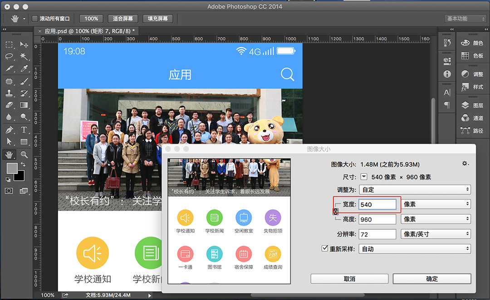

# 切图规范

## 切图制作流程

?> BUI有独特的自适应规范,这个规范跟正常的web切图流程一致, 唯一需要注意的就是单位的转换, BUI的制作是基于rem缩放, <del>1.4.X 基于540px设计稿量取大小</del> <strong style="color:red">1.5.X 基于750x设计稿量取大小</strong>, 1rem = 100px; 这样做出来的应用,能保持在各种系统,各种浏览器,保持跟设计稿一致的效果. 

## 按源稿大小切图
1. 打开PSD源稿
2. 选中图片,导出为PNG格式, ( 这里用到一个 <a href="http://www.cutterman.cn/zh/cutterman" target="_target">cutterman</a> PS插件;
2. 把图片放到BUI开发包的 `images` 目录下;
?>images目录里面可以自行规划,例如:icons,banner等;

**演示:**


## 转换设计稿大小
> BUI独创的基于REM适配手机,保持跟原生DPI一致的缩放效果, 需要把设计稿转换为750的设计稿,这样量取到的值,直接除以100,便是rem值.


### 把设计稿更改为`750px`宽度,高度等比缩放的设计稿



### 量取设计稿内容的大小/100, 转成rem单位


*说明:*

?>如果希望slide的高度随着移动设备的不同比例缩放,需要转换成rem单位, 比方,你量取到的宽度是`750px`,高度是`270px`的焦点图, 那么写成 `2.7rem = 270px/100` ; 这样页面的slide,就会根据手机的分辨率不同,自动更改为等比的焦点图.
```css
.slide { width:100%;height:2.7rem; } 
```
----

?> **如果写成`270px` 会有什么问题呢? **

答: 如果是写成`270px` 那么页面的高度就剩下不多(iphone4 高度`480px`,iphone5 高度`568px`),最终做出来的页面,跟设计稿会有比较大的误差.而设置成`2.7rem`以后,就会随着不同DPI而转换成等比的高度; 换句话说,设计搞放到手机上是什么样子,做出来就是什么样子, 精确还原.

----
?>**那么是不是所有的 px 都需要这样转换呢? **

答: `1px` 不需要转换,直接就写`1px`;